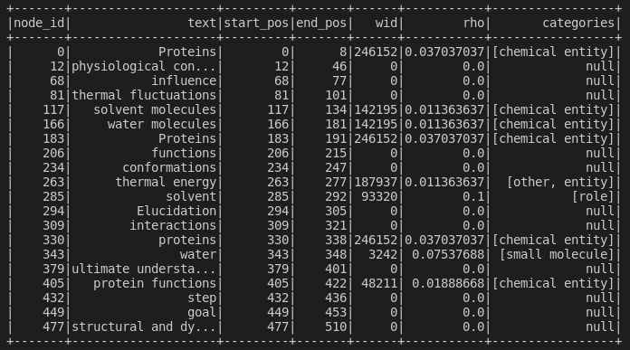
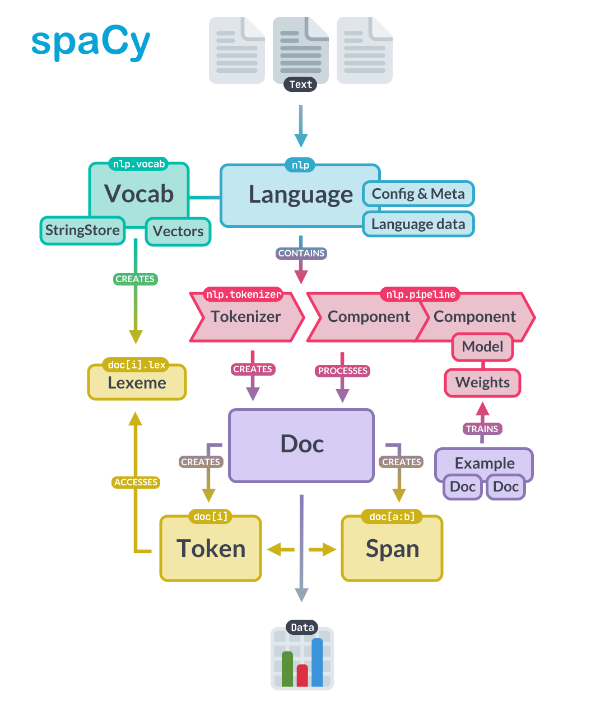
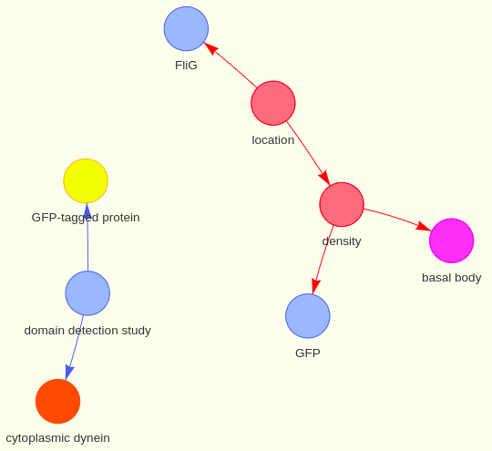

<h1>WeNet<h1>
<div align="center">
<h2>A PubMed Central real time knowledge graph generator and analyzer</h2>
  
  
  </div>
<br>

## Requirements
* Put articles_bulk.json in "Server" directory;
### download required files at: 
https://drive.google.com/drive/folders/11jqONNuaLajONQrGrEyS7R5K-US80fYx?usp=sharing
  
## Run the project
```shell
$ git clone https://github.com/Mantellinas/weNet.git
$ cd KnowledgeGraphBuilder
$ docker-compose up 
```
## Data pipeline

<p align="center">
  
</p>


##   PubMed Central repository
  
All the documents are downloaded from the PubMed central Repository and stored in a json (test json at <a href="https://drive.google.com/drive/folders/11jqONNuaLajONQrGrEyS7R5K-US80fYx?usp=sharing">here</a>). 
PubMed is a free search engine accessing primarily the MEDLINE database of references and abstracts on life sciences and biomedical topics. The United States National Library of Medicine (NLM) at the National Institutes of Health maintain the database as part of the Entrez system of information retrieval.


##  LogStash


### Centralize, transform & stash your data

* "Logstash is a free and open server-side data processing pipeline that ingests data from a multitude of sources, transforms it, and then sends it to your favorite "stash".
 
* "Logstash dynamically ingests, transforms, and ships your data regardless of format or complexity. Derive structure from unstructured data with grok, decipher geo coordinates from IP addresses, anonymize or exclude sensitive fields, and ease overall processing".

### Logstash configuration
  
<p align="center">
    
</p>

##  Kafka


### Stream processing has never been a more essential programming paradigm

* "Apache Kafka is an open-source distributed event streaming platform used by thousands of companies for high-performance data pipelines, streaming analytics, data integration, and mission-critical applications".

<p align="center">
    
</p>

 

##  Spark


### Unified engine for large-scale data analytics

* "Apache Spark™ is a multi-language engine for executing data engineering, data science, and machine learning on single-node machines or clusters".
* "Spark provides an interface for programming clusters with implicit data parallelism and fault tolerance".
* Spark Streaming is an extension of the core Spark API that enables scalable, high-throughput, fault-tolerant stream processing of live data streams. Data can be ingested from many sources like Kafka, Kinesis, or TCP sockets, and can be processed using complex algorithms expressed with high-level functions like map, reduce, join and window. Finally, processed data can be pushed out to filesystems, databases, and live dashboards. In fact, you can apply Spark’s machine learning and graph processing algorithms on data streams.
  
  
<p align="center">
    
</p>

 ### Example of a batch graph nodes dataframe
 <p align="center">
    
</p>
 ### Example of a batch graph edges dataframe
 <p align="center">
    
</p>


##  Spacy
### Industrial-Strength Natural Language Processing
* spaCy is a free, open-source library for advanced Natural Language Processing (NLP) in Python. If you’re working with a lot of text, you’ll eventually want to know more about it. For example, what’s it about? What do the words mean in context? Who is doing what to whom? What companies and products are mentioned? Which texts are similar to each other? spaCy is designed specifically for production use and helps you build applications that process and “understand” large volumes of text. It can be used to build information extraction or natural language understanding systems, or to pre-process text for deep learning.
* "scispaCy is a Python package containing spaCy models for processing biomedical, scientific or clinical text."
 <p align="center">
    
</p>
  


##  ElasticSearch


### Search. Observe. Protect.
* "Elasticsearch is a distributed, free and open search and analytics engine for all types of data, including textual, numerical, geospatial, structured, and unstructured".
* "Elasticsearch is a RESTful search and analytics engine  capable of addressing a growing number of use cases. As the heart of the Elastic Stack, it centrally stores your data for lightning fast search, fine‑tuned relevancy, and powerful analytics that scale with ease".

<p align="center">
    
</p>


##  Kibana

### Your window into the Elastic Stack

* "Kibana is a free and open user interface that lets you visualize your Elasticsearch data and navigate the Elastic Stack. Do anything from tracking query load to understanding the way requests flow through your apps".
<p align="center">
    
</p>


##  Vis.js


### Bored of premade tool? Go vanilla
* With tools like Kibana, Grafana and associated plugin is very difficult and some times impossible to plot graphs in real time. In this regard we created our personal realtime dashboard to analyze, inspect and play with the generated knowledge graphs.
* The dashboard loads data from elasticsearch using a Flask RESTFUL api and plot the network structure using a javascript library called vis.js
### Run the web interface
```shell
$ cd VisualizeNetwork/graphServer
  python3 graph_server.py
```
* Open the VisualizeNetwork/graphGui/index.html page.
  
<p align="center">
    
</p>

### Graph Visualization Interface
<p align="center">
  
</p>
  
### Graph visualization detail
<p align="center">
    
</p>


## Useful links 

| Container     | URL                                             | Description                           |
| ------------- | ----------------------------------------------- | ------------------------------------- |
| kafka UI      | http://localhost:8080                           | Open kafka UI to monitor kafka server |
| elasticsearch | http://localhost:9200                           | Open elasticsearch cluster index      |
| kibana        | http://localhost:5601                           | Kibana base URL                       |
| graph GUI     | http://localhost:3000                           | Vis.js real time graph visualizer     |


## Authors 

* [Rosario Cannavò](https://github.com/rosariocannavo)
* [Mario Benissimo](https://github.com/mariobenissimo) 

